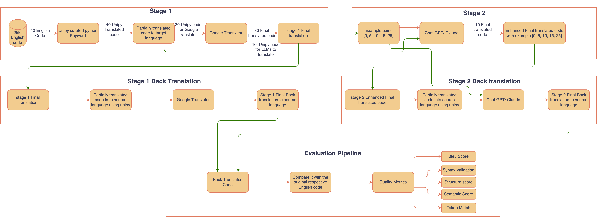

# PyLinguist: Automated Translation of Python for Non-English Programmers

PyLinguist is a novel system for translating Python code from English to multiple languages while preserving functionality. It implements a two-stage translation pipeline supporting seven languages (Hindi, Bengali, Mandarin, Greek, Kurdish, French, Spanish) that combines keyword mapping with machine translation, followed by contextual refinement using large language models.

## Overview

PyLinguist addresses the critical accessibility gap for non-English speakers learning programming by providing a practical implementation that maintains code functionality while making Python more accessible to diverse linguistic communities.



## Installation

```bash
pip install -r requirements.txt
```

## Usage

PyLinguist follows a two-stage translation process:

```bash
python3 scripts/translate.py --source-lang en --target-lang hi --start-index 0 --stage1-samples 10 --stage2-samples 2 --stage1 google --stage2 gpt
```

## Command Line Arguments

- `--preprocess-only`: Only preprocess the dataset without translation
- `--dataset`: Specify the HuggingFace dataset name (default: "jtatman/python-code-dataset-500k")
- `--batch-size`: Batch size for processing (default: 1000)
- `--force-preprocess`: Force preprocessing even if dataset exists
- `--start-index`: Starting index in the dataset (default: 0)
- `--stage1-samples`: Number of samples for Stage 1 (default: 10)
- `--stage2-samples`: Number of samples for Stage 2 (default: 30)
- `--source-lang`: Source language code (required)
- `--target-lang`: Target language code (required)
- `--stage1`: Stage 1 translation method, choose from ['google'] (required)
- `--stage2`: Stage 2 translation method, choose from ['gpt', 'claude']

## Pipeline Process

1. **Stage 1 (Basic Translation)**:
   - Tokenizes Python code and maps English keywords to target language equivalents
   - Preserves code structure and indentation
   - Applies Google Translate for natural language elements (comments, variable names)
   - Outputs a partially translated code that maintains functionality

2. **Stage 2 (Enhanced Translation)**:
   - Uses LLM models (GPT-4o or Claude) for contextual refinement
   - Provides example pairs from Stage 1 as few-shot learning
   - Improves translation quality while maintaining code structure
   - Supports various example counts (0, 5, 10, 15, 25) for different learning approaches

## Project Structure

- `data/`: Contains input datasets and processed outputs
- `pylinguist/`: Main package source code
  - `models/`: Translation model implementations
    - `stage1/`: Stage 1 translation models (Google)
    - `stage2/`: Stage 2 LLM enhancement models (GPT, Claude)
  - `evaluation/`: Evaluation metrics and tools
  - `utils/`: Utility functions for preprocessing and data handling

## Supported Languages

- Hindi (hi)
- Bengali (bn)
- Mandarin Chinese (zh-CN)
- Greek (el)
- Kurdish (ku)
- Spanish (es)
- French (fr)

## Requirements

The project requires several dependencies which can be installed using the requirements.txt file:

- pandas
- numpy
- torch
- transformers
- deep-translator
- nltk
- sacrebleu
- openai
- datasets
- python-dotenv
- anthropic

## Note

For Stage 2 translation with GPT or Claude, you'll need to set up the appropriate API keys in your environment:
- `OPENAI_API_KEY` for GPT models
- `ANTHROPIC_API_KEY` for Claude models

## Visualization

The project includes a Jupyter notebook for visualizing evaluation results. Run the `Visualization.ipynb` notebook to generate performance charts and comparisons between different models and language pairs.